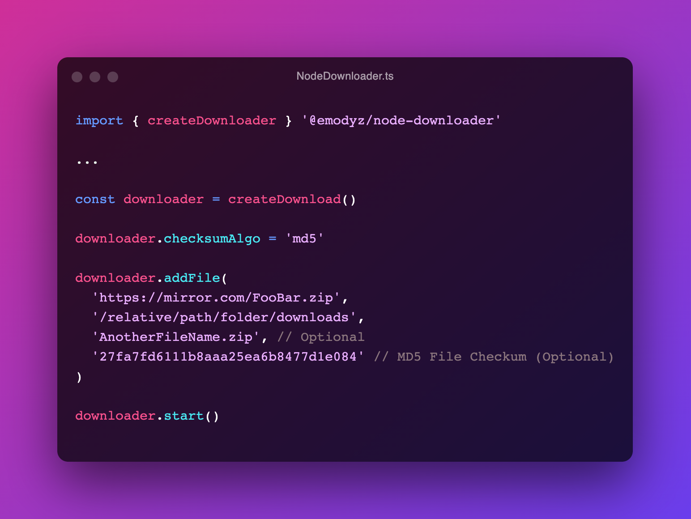

# NodeDowloader




Multiple Files NodeDownloader

This project was built for emodyz/LauncherMultigaming.  
He provide a multiple files download system.

## Features

- [X] Multiple downloads
- [X] File checksum ability 
- [X] Global progress (Download + Checksum)
- [X] Retries on fail
- [ ] Sync option to delete local extra files

## Documentation

[NodeDownloader Documentation](https://emodyz.github.io/NodeDownloader)

## Installing NodeDownloader

```
npm install @emodyz/node-downloader
```
